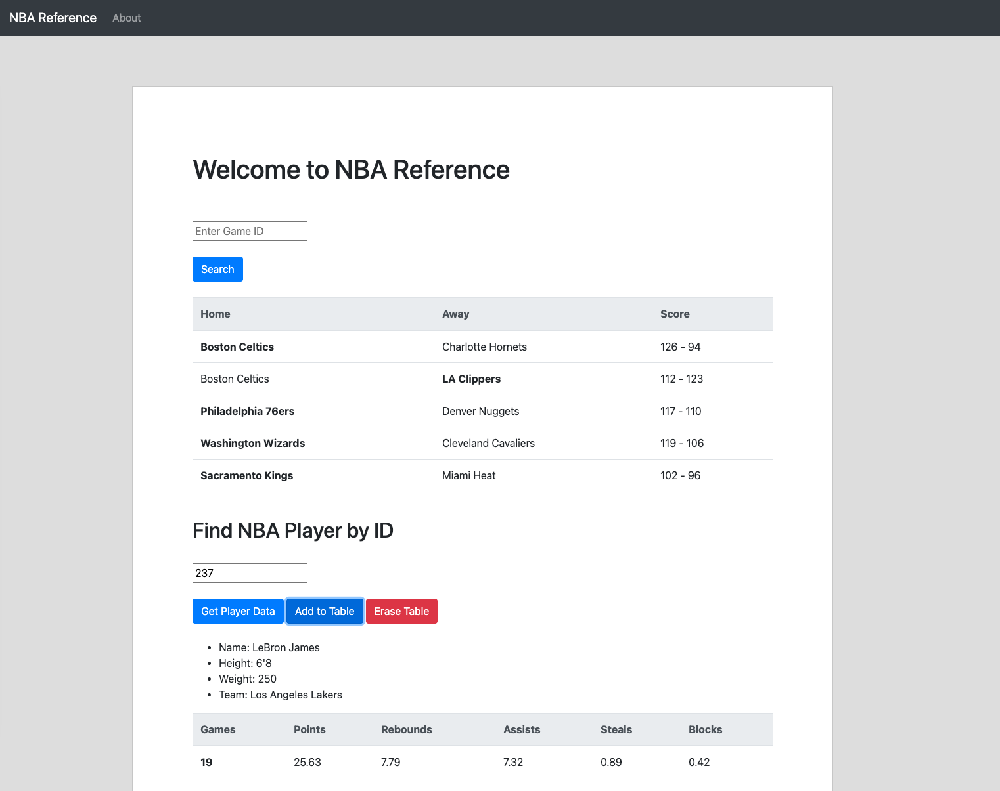

# NBA-Stats-Website
This webpage uses Flask to grab data from BallDontLie.io to display stats from the NBA

Project Summary: This is a website I made to display player and team stats from the NBA. This website can be used to find player and team information, player stats,
and results from NBA games. I made this website to learn how to use RESTful requests with Flask to transfer API data from Python to Javascript. All stats and data
come from https://www.balldontlie.io/.

Tools Used: Python, Javascript, HTML, CSS, Flask, Ajax, Bootstrap, Jinja

